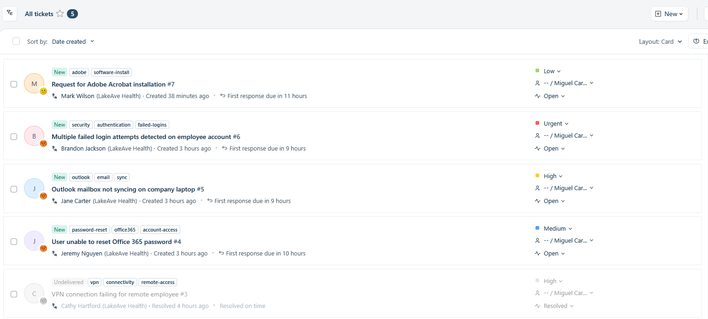
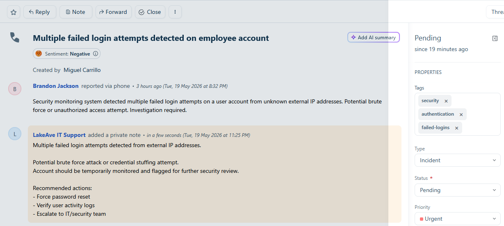
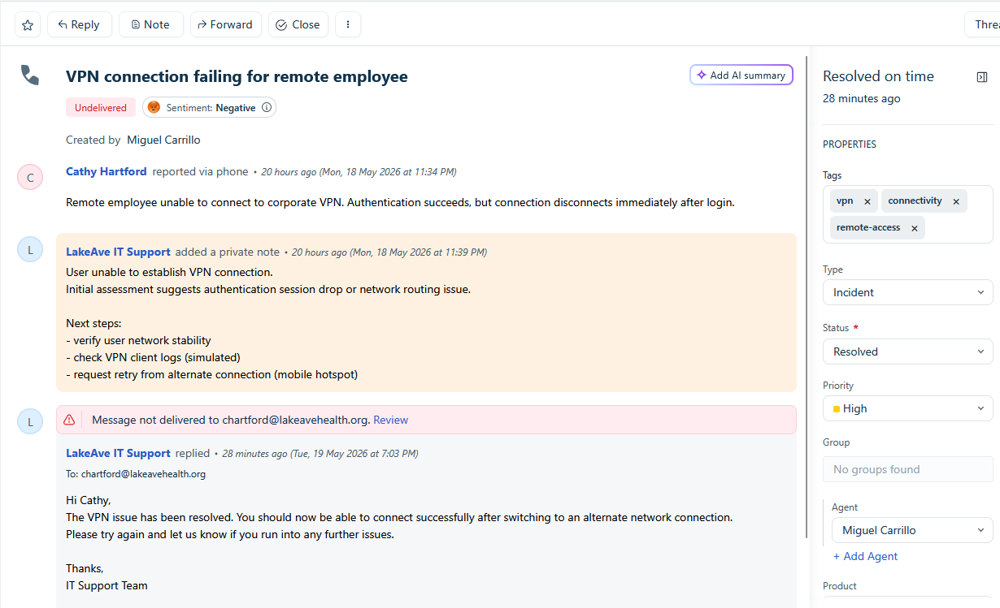

# IT Help Desk Ticketing Simulation Lab

## Overview
This project simulates a real-world IT Service Desk environment for a fictional healthcare organization, **LakeAve Health Systems**, using the Freshdesk cloud ticketing platform.

The lab was designed to replicate common Tier 1 IT support responsibilities including ticket intake, triage, prioritization, troubleshooting, escalation, documentation, and resolution workflows.

The goal of this project was to build hands-on operational experience with modern help desk processes while demonstrating professional documentation and customer support practices.

---

## Environment Summary

### Simulated Organization
- LakeAve Health Systems
- Healthcare-focused support environment
- Remote and office-based users

### Platform Used
- Freshdesk (Cloud Help Desk System)

### Simulated Support Areas
- VPN connectivity support
- Microsoft Office 365 account support
- Outlook email troubleshooting
- Software installation requests
- Security-related login investigations

---

# Skills Demonstrated

## IT Support Operations
- Ticket lifecycle management
- Queue prioritization
- Incident handling
- End-user support request fulfillment
- User support workflows

## Troubleshooting
- VPN connectivity troubleshooting
- Outlook synchronization issue handling
- Office 365 account access support
- Software provisioning workflows

## Security Awareness
- Detection of suspicious authentication activity
- Escalation workflow documentation
- Security-focused ticket triage
- Incident escalation procedures

## Documentation & Communication
- Internal troubleshooting documentation
- Public customer-facing responses
- Resolution documentation
- Ticket update management

---

# Ticket Scenarios

| Ticket | Category | Status |
|---|---|---|
| VPN Connectivity Issue | Incident | Resolved |
| Office 365 Password Reset | User Support | Pending |
| Outlook Mailbox Sync Issue | Incident | Pending |
| Failed Login Attempt Investigation | Security Escalation | Escalated |
| Adobe Acrobat Installation Request | User Support | Resolved |

---

# Workflow Highlights

## Ticket Lifecycle Management
Simulated complete ticket handling workflows including:
- Ticket creation
- Initial triage
- Troubleshooting documentation
- Priority handling
- Escalation procedures
- Resolution updates

## Queue Management
Managed multiple concurrent tickets with varying priorities and issue types to simulate realistic IT support operations.

## Security Escalation
Escalated suspicious login activity after identifying indicators consistent with unauthorized authentication attempts and documented recommended containment actions.

---

# Screenshots

## Ticket Queue Overview

## Security Escalation Workflow

## Ticket Resolution Example

Demonstrates documented troubleshooting communication and completed ticket resolution workflow. Delivery notification messages appear because the environment used simulated email accounts and non-production domains; in a live production environment, the workflow and communication process would function normally.

# Project Outcomes
This lab strengthened practical understanding of IT support operations, ticket management workflows, troubleshooting processes, escalation handling, and customer communication within a simulated enterprise support environment.

---

# Note
This project was created for educational and portfolio purposes using a simulated IT support environment. All organizations, users, domains, and support scenarios are fictional.
Because the environment used simulated email accounts and non-production domains, some outbound ticket responses generated delivery notification messages within the ticketing platform.
